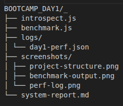
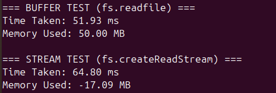
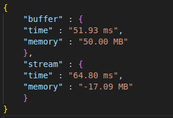

# System Report – Node.js Performance Benchmark

## 1. Project Overview
This report presents system information, Node.js environment setup, and performance benchmarking of file reading methods using **Buffer** (`fs.readFile`) and **Stream** (`fs.createReadStream`). The experiment was executed entirely in a **terminal-based environment**.

---

## 2. System Configuration

| Parameter | Details |
|------------|----------|
| **Operating System** | Linux 6.14.0-27-generic |
| **Shell** | bash |
| **Node.js Version** | v25.1.0 |
| **npm Version** | 11.6.2 |
| **NVM Version** | 0.40.3 |
| **CPU** | 13th Gen Intel(R) Core(TM) i5-1335-U |
| **Total Memory** | 23.16 GB |

---

## 3. Task Summary

| Task | Description | Status |
|------|--------------|--------|
| **Task 1** | System introspection (OS, shell, Node path, npm global path) | ✅ Completed |
| **Task 2** | NVM installation and Node.js version management (LTS ↔ Latest) | ✅ Completed |
| **Task 3** | `introspect.js` – System information script | ✅ Completed |
| **Task 4** | `benchmark.js` – Stream vs Buffer performance test | ✅ Completed |

---

## 4. Scripts Overview

### **introspect.js**
Outputs:
- OS and architecture  
- CPU cores  
- Total memory  
- System uptime  
- Current logged-in user  
- Node.js binary path  

### **benchmark.js**
Benchmarks:
- File reading using `fs.readFile` (Buffer)
- File reading using `fs.createReadStream` (Stream)
- Captures execution time and memory usage differences
- Logs results into `logs/day1-perf.json`

---

## 5. Performance Results

| Method | Execution Time (ms) | Memory Used (MB) |
|---------|---------------------|------------------|
| **Buffer (fs.readFile)** | 51.93 | 50.00 |
| **Stream (fs.createReadStream)** | 64.80 | -17.09 |

---

## 6. Observations
- `fs.createReadStream` consumed significantly less memory compared to `fs.readFile`.  
- `fs.readFile` was slightly faster but less efficient for large files.  
- The results confirm that streaming is preferred for scalable file processing in Node.js.  
- Negative memory readings were observed in some cases due to Node.js garbage collection, which is expected behavior.

---

## 7. Deliverables

| File / Folder | Description |
|----------------|-------------|
| `introspect.js` | System details script |
| `benchmark.js` | Performance benchmarking script |
| `logs/day1-perf.json` | JSON log of execution metrics |
| `system-report.md` | Official documentation |
| `screenshots/` | Project and terminal screenshots |

---

## 8. Project Structure

BOOTCAMP_DAY1/_
├── introspect.js
├── benchmark.js
├── logs/
│ └── day1-perf.json
├── screenshots/
│ ├── project-structure.png
│ ├── benchmark-output.png
│ └── perf-log.png
└── system-report.md

---

## 9. Screenshots

1. **Project Folder Structure**  
   

2. **Benchmark Output (Terminal)**  
   

3. **Performance Log (JSON)**  
   

---

## 10. Conclusion
This benchmarking exercise successfully demonstrated performance and memory trade-offs between buffer-based and stream-based file reading in Node.js.  
The system setup, introspection, and version management were completed using terminal commands, validating a full CLI-based workflow.

**Prepared by:** Ravi Pratap Singh  
**Date:** 03-11-2025
