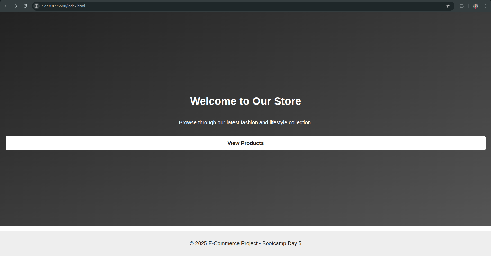
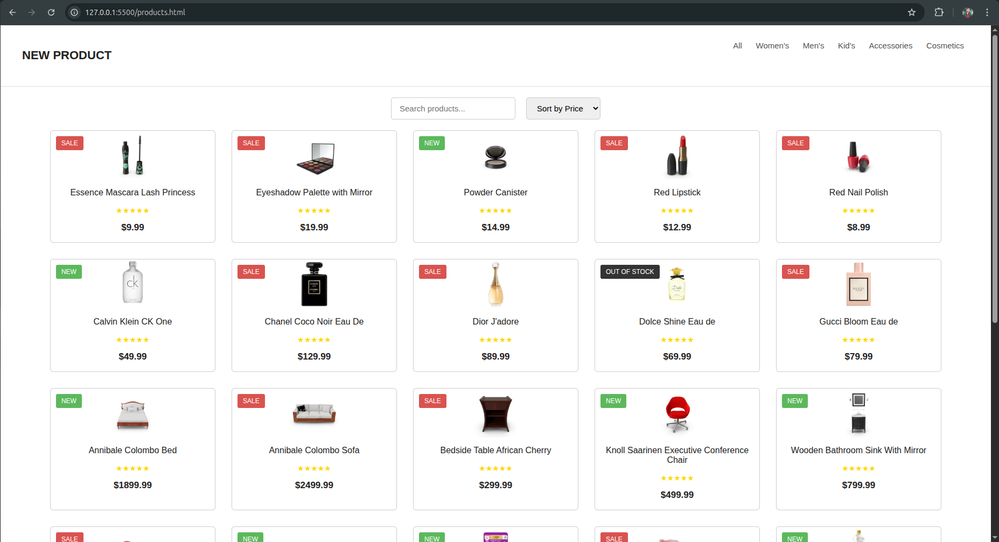
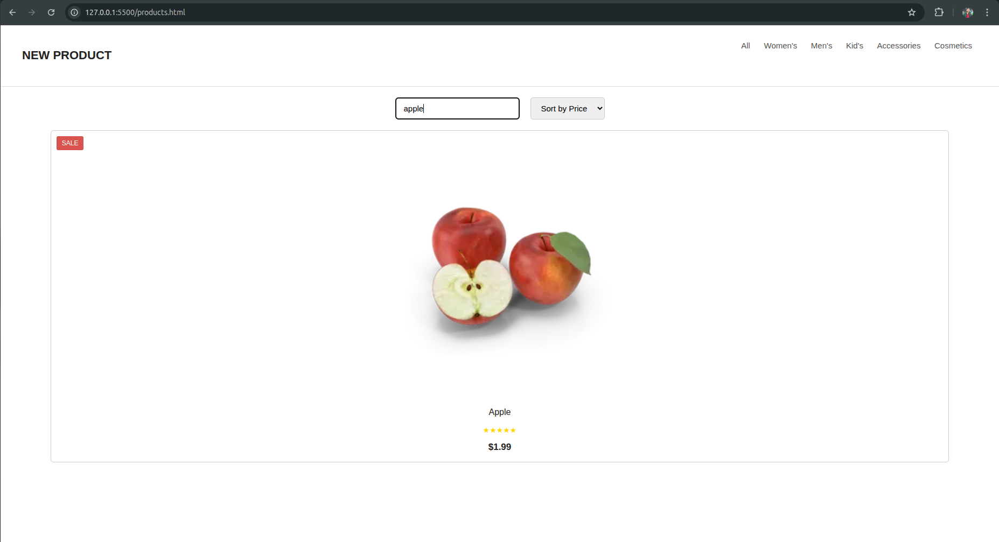

# 🛍️ E-Commerce Demo Store  
A simple and clean frontend project built using **HTML, CSS, and JavaScript**.  
This demo fetches products from an API and displays them in a responsive grid with search and sorting features.  
It’s part of **Bootcamp Week 2 – Day 5 (Capstone UI + JS Project).**

---

## 🚀 Features

### 🔹 Live Product Data (API Fetch)
The products are loaded using the `fetch()` API from DummyJSON:
https://dummyjson.com/products

### 🔹 Search Bar (Real-time Filtering)
As you type in the search bar, the products get filtered instantly.

### 🔹 Sort by Price
Sort products:
- **High → Low**
- **Low → High**

### 🔹 Product Cards with Tags
Each product gets an automatic label:
- **SALE** (discount > 10%)  
- **NEW** (default tag)  
- **OUT OF STOCK** (stock < 5)

### 🔹 Responsive Design
The layout adjusts smoothly on laptops, tablets, and mobile phones using CSS Grid + Media Queries.

---

## 📂 Project Structure

week2_frontend/
│── index.html # Landing page
│── products.html # Product listing page
│── style.css # UI styling + responsive design
│── script.js # Fetch API + search + sorting + dynamic rendering
│── README.md
└── screenshots/ # Project screenshots
├── Screenshot_1.png
├── Screenshot_2.png
├── Screenshot_3.png
├── Screenshot_4.png
└── Screenshot_5.png

---

## 📸 Screenshots

Here are the visual previews of the project:

### 🏠 **Homepage**

### 📦 **Products Page – Full Grid**

### 🔍 **Search Feature Preview**

### ↕️ **Sorting Feature Preview**

---

## 🧠 How the App Works

### 1️⃣ Fetch Data  
`script.js` loads products from the DummyJSON API using `async/await`.

### 2️⃣ Render Product Cards  
Each card shows:  
- Title  
- Image  
- Price  
- Rating (static stars)  
- Tag based on product condition  

### 3️⃣ Search Bar  
Filters products by checking if the product title includes your typed text.

### 4️⃣ Sorting  
A simple number comparison rearranges products from high-to-low or low-to-high price.

### 5️⃣ Responsive CSS  
Media queries adjust the product grid and layout for mobile screens.

---

## 🛠️ Tech Stack

- **HTML5**
- **CSS3** (Flexbox, Grid, Media Queries)
- **JavaScript (Vanilla JS)**
- **DummyJSON API**
- **Git & GitHub**

---

